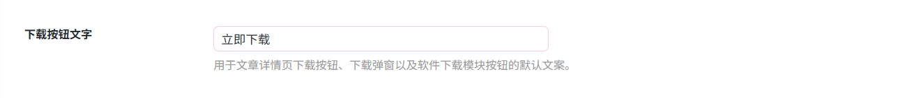
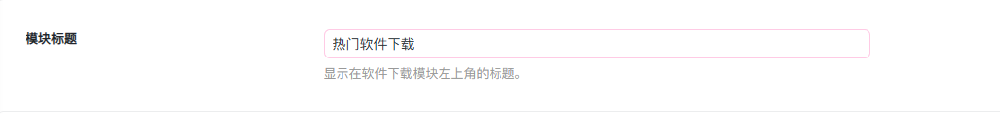
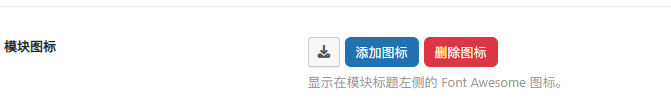
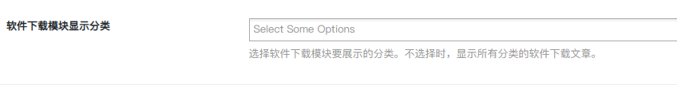
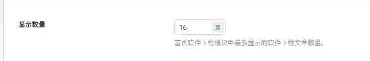

# 软件下载模块设置
作者：[阿城](https://blog.morehouse-s.com/)

## 下载按钮文字

## 模块标题

设置软件下载模块在页面左上角显示的标题文字。

## 模块图标

用来在模块标题左侧添加或移除一个 Font Awesome 图标。

## 软件下载模块显示分类

筛选和控制模块中显示的软件下载文章所属分类。

## 显示数量

用来控制首页软件下载模块中最多展示多少篇软件下载文章。

